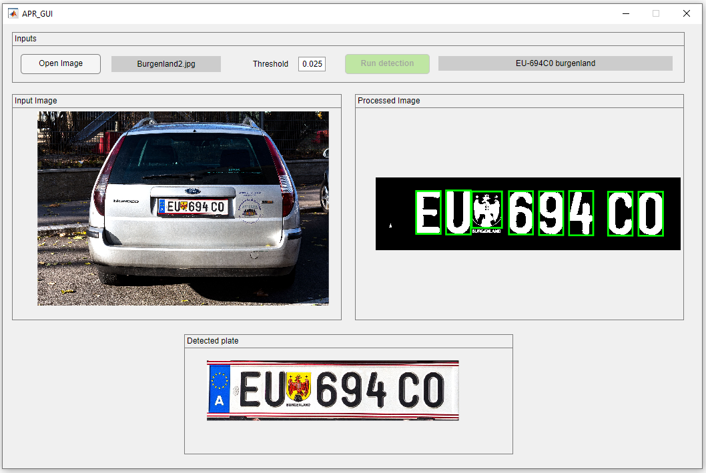
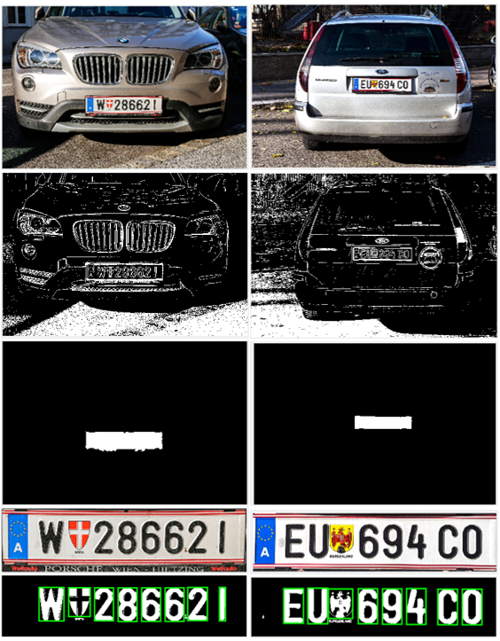

# License Plate Recognition

Computer vision application for the detection of license plates and recognition of the license plate characters and the federal state in RGB car images.

## Table of contents

* [General Info](#general-info)
* [User Interface](#user-interface)
* [Image Processing Pipeline](#image-processing-pipeline)
* [Example Results](#example-results)
* [Usage](#usage)
* [Sources](#sources)

## General Info

This repository contains a MATLAB implementation for automatic license plate recognition. It utilizes image processing techniques to locate, segment, and recognize characters from license plates in RGB images.
The application takes an RGB image of a car as input and outputs the recognised letters of the license plate as well as the federal state if it is an Austrian license plate.

## User Interface

    	

* Open Image: loads the image from the dataset folder
* Threshold: how aggresive the image is opened to detect edges (range = [0.001, 0.1], default = 0.025)
* Run detection: start the license plate recognition pipeline
&nbsp;
* Input Image: shows the loaded input image
* Processed Image: shows the current step of the processing pipeline
* Detected plate: image of the detected plate

## Image Processing Pipeline
* **License Plate Detection**
	- **Median Filtering** (to remove noise)
	- **Adaptive Histogram Equalization** (to enhance contrast)
	- **Image Subtraction** (to enhance edges)
	- **Sobel filtering** (to detect edges)
	- **Mathematical Morphologies** (Dilate and Erode, to close gaps in lines)
	- **Floodfill** (to fill holes)
	- **Connected-Component Labeling** (to determine the final position of the license plate)
	
* **Character Segmentation**
    - **Image Pyramid Reduction** (to reduce the size of the image)
	- **Template Matching** (to match the characters to the tempalates using a correlation coefficient)
	
## Example Results

    	

## Usage

**Prerequisites**: A functional Matlab distribution is installed on your computer.

The 'src' folder in the project folder contains the Matlab file 'app_GUI.m' which needs to be opened and executed. The 'Open Image' button loads an image from the 'dataset' folder. The 'Run detection' button 
starts the license plate detection pipeline.

## Sources

* [MATLAB](https://de.mathworks.com/)
&nbsp;
* Kaur, S., & Kaur, S. (2014). An efficient approach for number plate extraction from vehicles image under image processing. International Journal of Computer Science and Information Technologies, 5(3), 2954-2959.
* Kukreja, A., Bhandari, S., Bhatkar, S., Chavda, J., & Lad, S. (2017). Indian vehicle number plate detection using image processing. Int Res J Eng Technol (IRJET), 4(4).
* Bhat, R., & Mehandia, B. (2014). Recognition of vehicle number plate using matlab. International journal of innovative research in electrical, electronics, instrumentation and control engineering, 2(8), 1899-1903.
